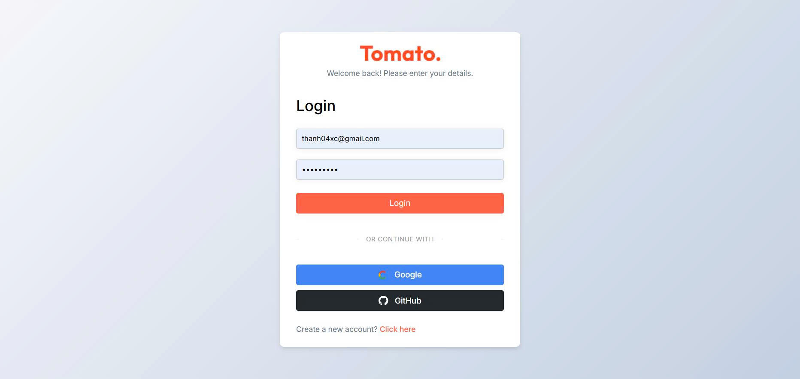
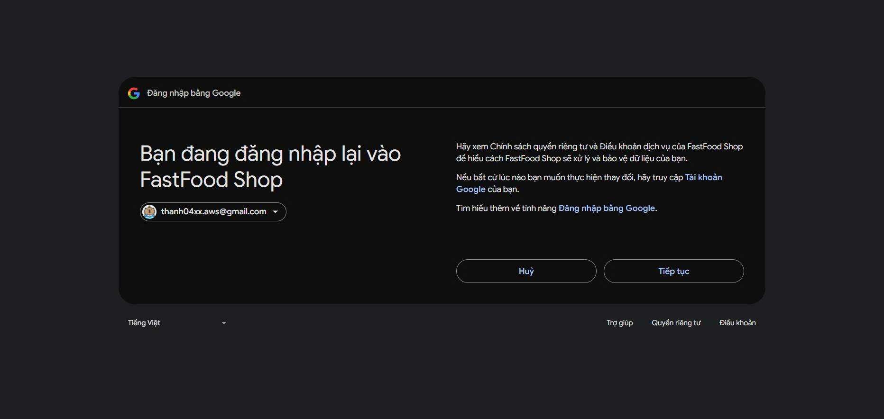
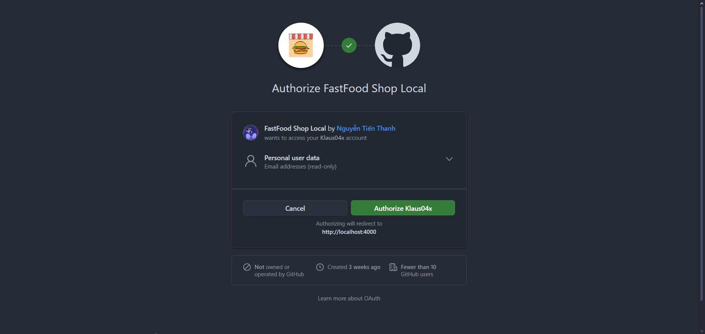
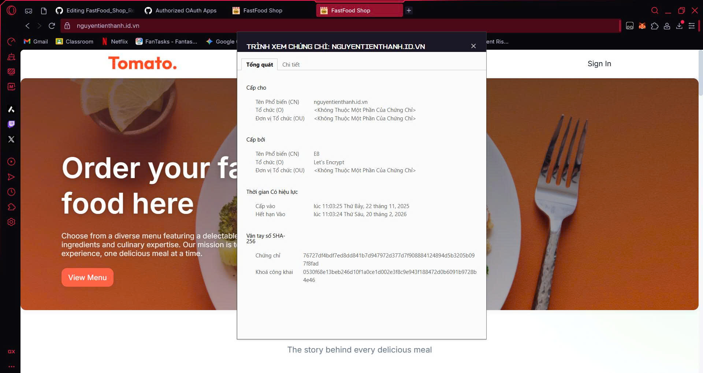

# 🍔 Nền tảng Đặt Món Ăn Trực Tuyến FastFood Shop

**Website Demo (HTTPS/SSL):** https://nguyentienthanh.id.vn

Ứng dụng web full-stack đặt món ăn được xây dựng với MERN stack (MongoDB, Express.js, React, Node.js). Bao gồm giao diện khách hàng, bảng quản trị admin và backend API với tích hợp thanh toán Stripe và đăng nhập OAuth.

## 📋 Mục Lục

- [Tính Năng](#-tính-năng)
- [Công Nghệ](#-công-nghệ)
- [Cấu Trúc Dự Án](#-cấu-trúc-dự-án)
- [Yêu Cầu](#-yêu-cầu)
- [Cài Đặt](#-cài-đặt)
- [Cấu Hình](#-cấu-hình)
- [Chạy Ứng Dụng](#-chạy-ứng-dụng)
- [API Endpoints](#-api-endpoints)
- [Hình Ảnh Demo](#hình-ảnh-demo)

## Phân Chia Công Việc

| Họ và tên            | MSV           | Nội dung thực hiện                              |
|----------------------|---------------|-------------------------------------------------|
| Nguyễn Tiến Thanh    | 22810310382   | Demo login bằng Google, cài đặt HTTPS, SSL      |
| Phạm Ngọc Huyên      | 22810310376   | Demo login bằng GitHub, cài đặt Firewall        |

## ✨ Tính Năng

### Khách Hàng
- **Xác thực người dùng**
  - Đăng ký/đăng nhập bằng email & mật khẩu
  - Đăng nhập bằng Google & GitHub OAuth
  - Xác thực JWT

- **Đặt món & Mua sắm**
  - Duyệt món ăn theo danh mục
  - Tìm kiếm và lọc món ăn
  - Giỏ hàng với cập nhật số lượng
  - Thanh toán qua Stripe

- **Quản lý đơn hàng**
  - Đặt hàng với địa chỉ giao hàng
  - Theo dõi trạng thái đơn hàng
  - Xem lịch sử đơn hàng

### Admin
- **Quản lý món ăn**
  - Thêm/sửa/xóa món ăn
  - Upload hình ảnh món ăn
  - Lọc theo danh mục

- **Quản lý danh mục**
  - Tạo và quản lý danh mục món ăn
  - Thêm hình ảnh và mô tả

- **Quản lý đơn hàng**
  - Xem tất cả đơn hàng
  - Cập nhật trạng thái đơn hàng

- **Thống kê**
  - Xem doanh thu và số liệu kinh doanh

## 🛠 Công Nghệ

### Frontend
- React 19.1.1 + Vite
- React Router DOM 7.9.4
- Axios 1.12.2
- React Toastify (Admin)

### Backend
- Node.js + Express.js 5.1.0
- MongoDB + Mongoose 8.19.1
- Passport.js 0.7.0 (OAuth Google & GitHub)
- JWT + Bcrypt
- Stripe 19.1.0
- Multer 2.0.2 (upload file)

## 📁 Cấu Trúc Dự Án

```
root/
├── frontend/           # Giao diện khách hàng (React)
│   ├── src/
│   │   ├── pages/     # Các trang (Home, Cart, Auth, Orders...)
│   │   ├── components/# Components (Navbar, FoodItem...)
│   │   ├── context/   # React Context
│   │   └── assets/
│   └── package.json
│
├── backend/            # API Server (Node.js/Express)
│   ├── config/        # Database & OAuth config
│   ├── models/        # Mongoose models
│   ├── controllers/   # Business logic
│   ├── routes/        # API routes
│   ├── middleware/    # Auth middleware
│   ├── uploads/       # Hình ảnh món ăn
│   ├── server.js
│   └── package.json
│
├── admin/             # Bảng quản trị (React)
│   ├── src/
│   │   ├── pages/    # Add, List, Edit, Orders, Categories, Statistics
│   │   ├── components/
│   │   └── assets/
│   └── package.json
│
└── package.json       # Monorepo config
```

## 📋 Yêu Cầu

- Node.js >= 16.x
- npm >= 7.x
- Tài khoản MongoDB Atlas
- Tài khoản Stripe (để thanh toán)
- Google & GitHub OAuth credentials (tùy chọn)

## 🚀 Cài Đặt

### 1. Clone repository
```bash
git clone https://github.com/Klaus04x/FastFood_Shop_React_Nodejs
cd FastFood_Shop_React_Nodejs
```

### 2. Cài đặt dependencies
```bash
npm install
```

Lệnh này sẽ cài đặt dependencies cho tất cả workspace (frontend, backend, admin).

## ⚙️ Cấu Hình

### Backend (.env)

Tạo file `.env` trong thư mục `backend`:

```env
# Server
PORT=4000

# Database
MONGO_URI=your_mongodb_connection_string

# JWT
JWT_SECRET=your_jwt_secret_key

# Stripe
STRIPE_SECRET_KEY=your_stripe_secret_key

# Session
SESSION_SECRET=your_session_secret

# OAuth - Google (xem OAuth_SETUP.md để biết chi tiết)
GOOGLE_CLIENT_ID=your_google_client_id
GOOGLE_CLIENT_SECRET=your_google_client_secret
GOOGLE_CALLBACK_URL=http://localhost:4000/api/auth/google/callback

# OAuth - GitHub (xem OAuth_SETUP.md để biết chi tiết)
GITHUB_CLIENT_ID=your_github_client_id
GITHUB_CLIENT_SECRET=your_github_client_secret
GITHUB_CALLBACK_URL=http://localhost:4000/api/auth/github/callback

# URLs
FRONTEND_URL=http://localhost:5173
ADMIN_URL=http://localhost:5174
```

### Frontend (.env)

Tạo file `.env` trong thư mục `frontend`:

```env
VITE_API_URL=http://localhost:4000
```

### Admin (.env)

Tạo file `.env` trong thư mục `admin`:

```env
VITE_API_URL=http://localhost:4000
```

### Cấu hình OAuth

Để thiết lập Google và GitHub OAuth, vui lòng xem hướng dẫn chi tiết trong file **[OAuth_SETUP.md](OAuth_SETUP.md)**.

### Cấu hình Database

1. Tạo tài khoản [MongoDB Atlas](https://www.mongodb.com/)
2. Tạo cluster mới
3. Tạo database user và whitelist IP
4. Lấy connection string và thêm vào file `.env`

### Cấu hình Stripe

1. Tạo tài khoản [Stripe](https://stripe.com/)
2. Lấy Secret Key từ Dashboard
3. Thêm vào file `.env` của backend

## 🏃 Chạy Ứng Dụng

### Chạy tất cả services (Khuyên dùng)

Từ thư mục gốc:

```bash
npm run dev:all
```

Lệnh này sẽ chạy:
- Backend API: `http://localhost:4000`
- Frontend: `http://localhost:5173`
- Admin: `http://localhost:5174`

### Chạy backend và frontend

```bash
npm run dev:be-fe
```

### Chạy từng service riêng lẻ

**Backend:**
```bash
cd backend
npm run server
```

**Frontend:**
```bash
cd frontend
npm run dev
```

**Admin:**
```bash
cd admin
npm run dev
```

### Seed Database (Tùy chọn)

Để thêm dữ liệu danh mục mẫu:

```bash
cd backend
node scripts/seedCategories.js
```

## 📡 API Endpoints

### Base URL
```
http://localhost:4000/api
```

### Xác thực

| Method | Endpoint              | Mô tả                  | Yêu cầu Auth |
|--------|-----------------------|------------------------|--------------|
| POST   | `/user/register`      | Đăng ký tài khoản      | Không        |
| POST   | `/user/login`         | Đăng nhập              | Không        |
| GET    | `/auth/google`        | Đăng nhập Google       | Không        |
| GET    | `/auth/github`        | Đăng nhập GitHub       | Không        |

### Món ăn

| Method | Endpoint              | Mô tả                  | Yêu cầu Auth |
|--------|-----------------------|------------------------|--------------|
| GET    | `/food/list`          | Lấy danh sách món ăn   | Không        |
| POST   | `/food/add`           | Thêm món ăn            | Có (Admin)   |
| PUT    | `/food/update/:id`    | Cập nhật món ăn        | Có (Admin)   |
| DELETE | `/food/remove/:id`    | Xóa món ăn             | Có (Admin)   |

### Danh mục

| Method | Endpoint              | Mô tả                  | Yêu cầu Auth |
|--------|-----------------------|------------------------|--------------|
| GET    | `/category/list`      | Lấy danh sách danh mục | Không        |
| POST   | `/category/add`       | Thêm danh mục          | Có (Admin)   |
| PUT    | `/category/update/:id`| Cập nhật danh mục      | Có (Admin)   |
| DELETE | `/category/remove/:id`| Xóa danh mục           | Có (Admin)   |

### Giỏ hàng

| Method | Endpoint              | Mô tả                  | Yêu cầu Auth |
|--------|-----------------------|------------------------|--------------|
| POST   | `/cart/add`           | Thêm vào giỏ hàng      | Có           |
| POST   | `/cart/remove`        | Xóa khỏi giỏ hàng      | Có           |
| POST   | `/cart/get`           | Lấy giỏ hàng           | Có           |

### Đơn hàng

| Method | Endpoint              | Mô tả                  | Yêu cầu Auth |
|--------|-----------------------|------------------------|--------------|
| POST   | `/order/place`        | Đặt hàng               | Có           |
| POST   | `/order/verify`       | Xác thực thanh toán    | Có           |
| POST   | `/order/userorders`   | Lấy đơn hàng của user  | Có           |
| GET    | `/order/list`         | Lấy tất cả đơn hàng    | Có (Admin)   |
| POST   | `/order/status`       | Cập nhật trạng thái    | Có (Admin)   |

### Thống kê

| Method | Endpoint              | Mô tả                  | Yêu cầu Auth |
|--------|-----------------------|------------------------|--------------|
| GET    | `/statistics/overview`| Lấy thống kê tổng quan | Có (Admin)   |

## Hình Ảnh Demo

### 1. Trang đăng nhập


### 2. Đăng nhập bằng Google (OAuth)


### 3. Đăng nhập bằng GitHub (OAuth)


### 4. Chứng nhận HTTPS & SSL (Bảo mật kết nối)


## 🤝 Đóng Góp

Mọi đóng góp đều được chào đón! Vui lòng:

1. Fork repository
2. Tạo branch mới (`git checkout -b feature/TinhNangMoi`)
3. Commit changes (`git commit -m 'Thêm tính năng mới'`)
4. Push lên branch (`git push origin feature/TinhNangMoi`)
5. Tạo Pull Request

## 📄 License

Dự án này được cấp phép theo giấy phép MIT.

## 👥 Tác Giả

- **Nguyễn Tiến Thanh** - [GitHub](https://github.com/Klaus04x/)

## 📞 Liên Hệ

Nếu cần hỗ trợ, vui lòng tạo issue trong repository này hoặc liên hệ qua email: thanh04xx@gmail.com

---
